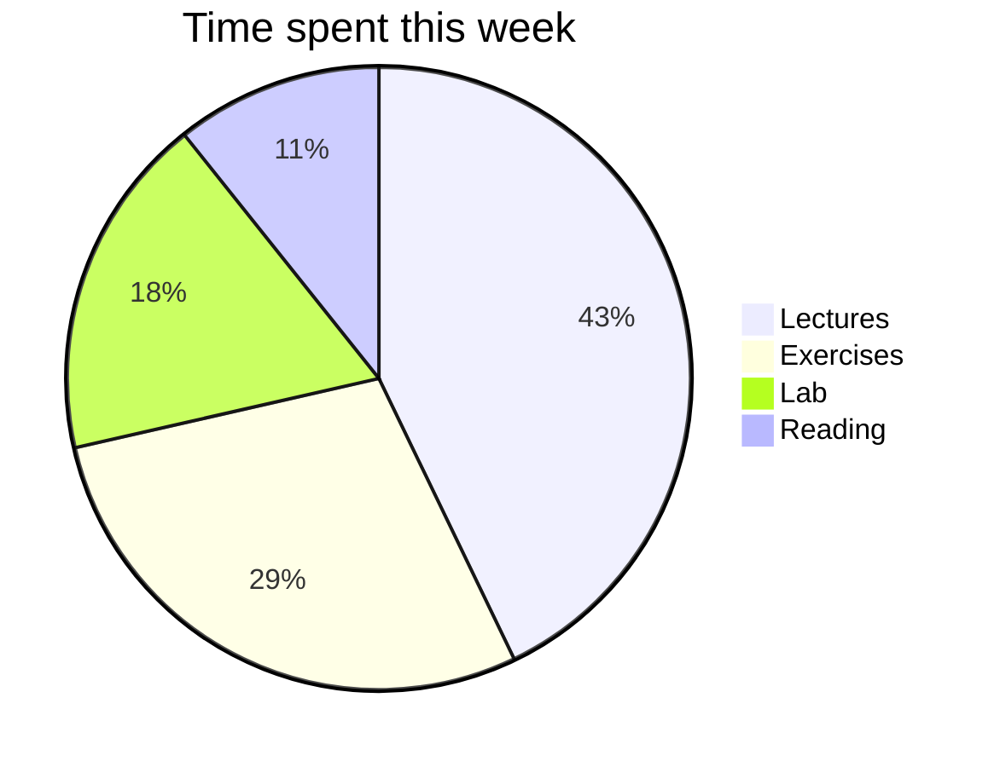
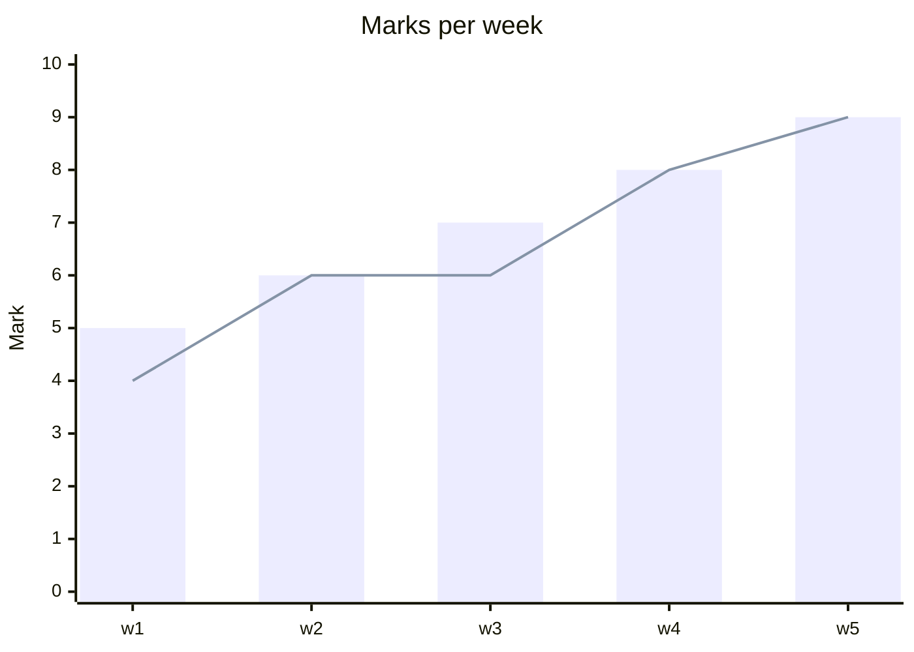
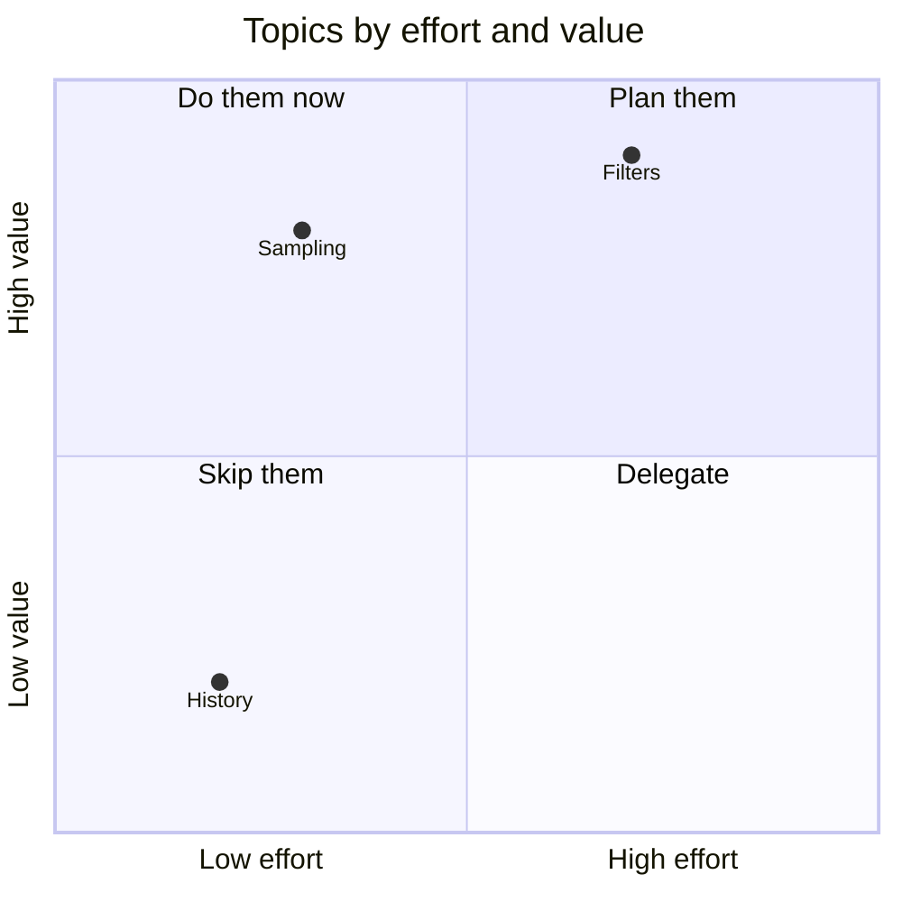
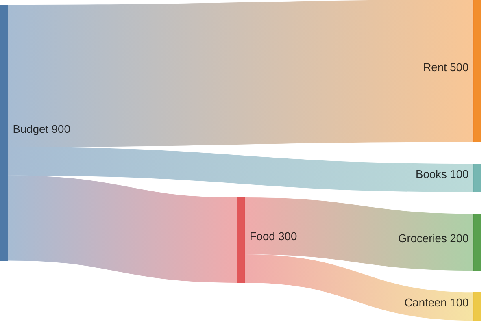

# Charts

## Pie

```mermaid
pie title Time spent this week
    "Lectures" : 12
    "Exercises" : 8
    "Lab" : 5
    "Reading" : 3
```

## XY chart

```mermaid
xychart-beta
    title "Marks per week"
    x-axis [w1, w2, w3, w4, w5]
    y-axis "Mark" 0 --> 10
    bar [5, 6, 7, 8, 9]
    line [4, 6, 6, 8, 9]
```

## Quadrant chart

```mermaid
quadrantChart
    title Topics by effort and value
    x-axis Low effort --> High effort
    y-axis Low value --> High value
    quadrant-1 Plan them
    quadrant-2 Do them now
    quadrant-3 Skip them
    quadrant-4 Delegate
    Sampling: [0.3, 0.8]
    Filters: [0.7, 0.9]
    History: [0.2, 0.2]
```

## Sankey

```mermaid
sankey-beta
Budget,Rent,500
Budget,Food,300
Budget,Books,100
Food,Groceries,200
Food,Canteen,100
```
