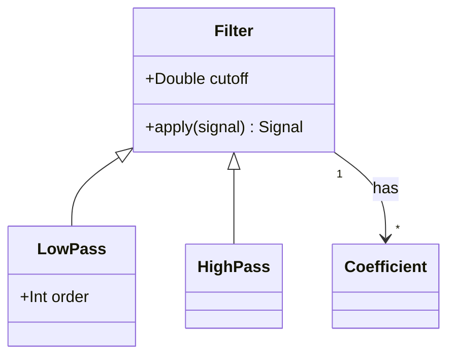
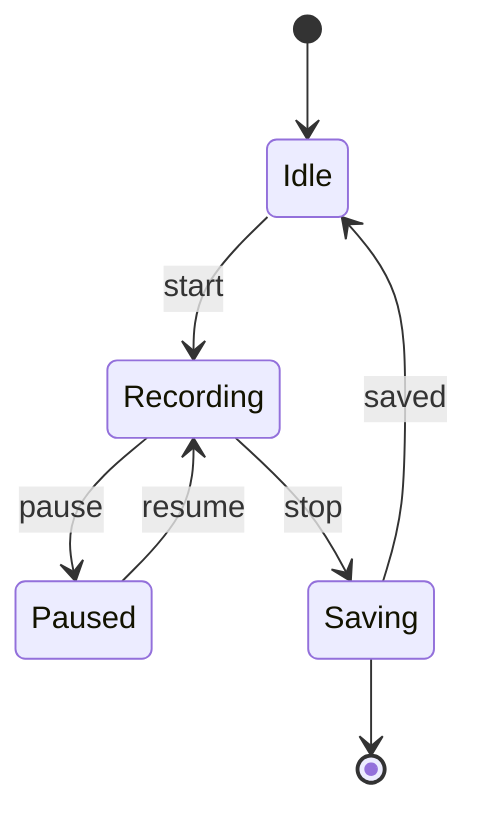
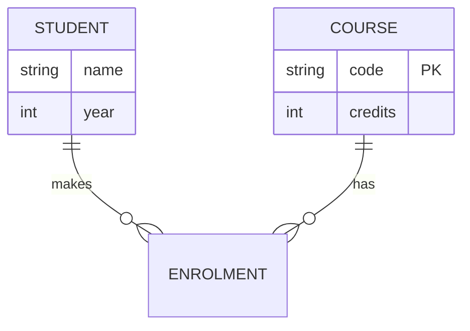

# Classes, states and entities

## Class diagram

```mermaid
classDiagram
    class Filter {
        +Double cutoff
        +apply(signal) Signal
    }
    class LowPass {
        +Int order
    }
    class HighPass
    Filter <|-- LowPass
    Filter <|-- HighPass
    Filter "1" --> "*" Coefficient : has
```

## State diagram

```mermaid
stateDiagram-v2
    [*] --> Idle
    Idle --> Recording : start
    Recording --> Paused : pause
    Paused --> Recording : resume
    Recording --> Saving : stop
    Saving --> Idle : saved
    Saving --> [*]
```

## Entity relationship diagram

```mermaid
erDiagram
    STUDENT ||--o{ ENROLMENT : makes
    COURSE ||--o{ ENROLMENT : has
    STUDENT {
        string name
        int year
    }
    COURSE {
        string code PK
        int credits
    }
```
