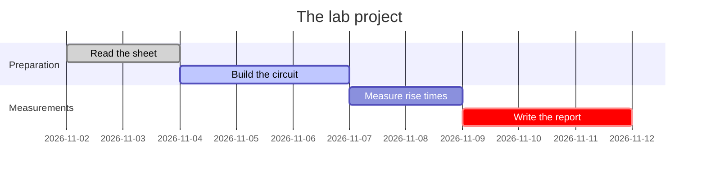
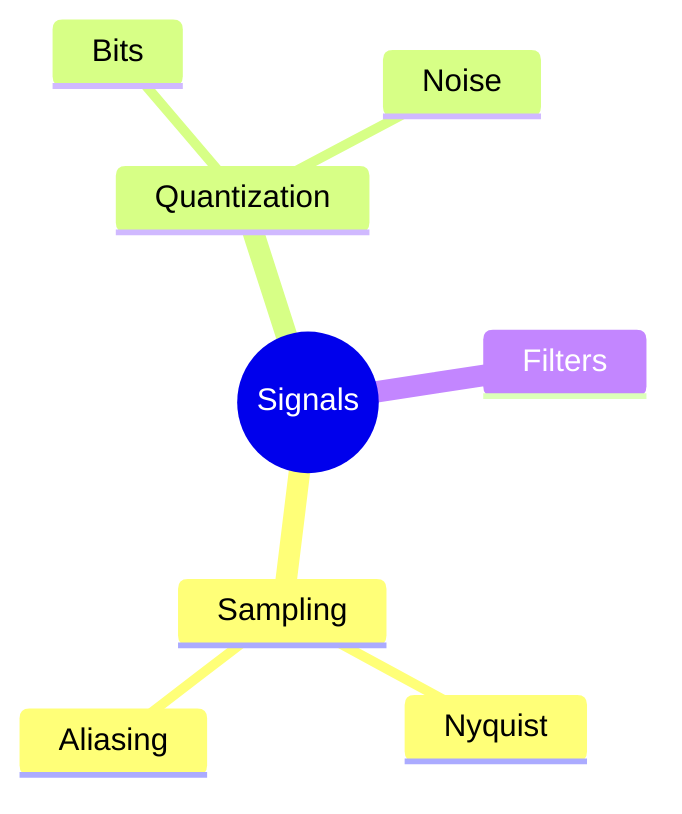
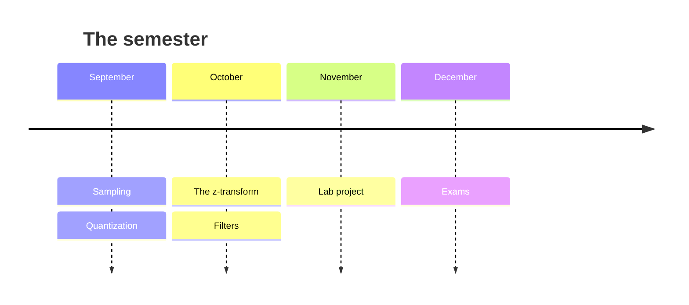
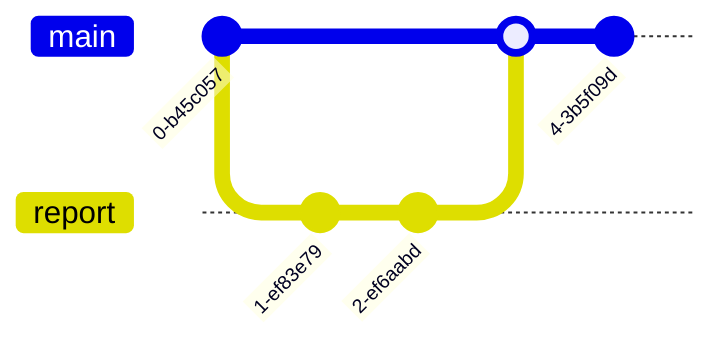
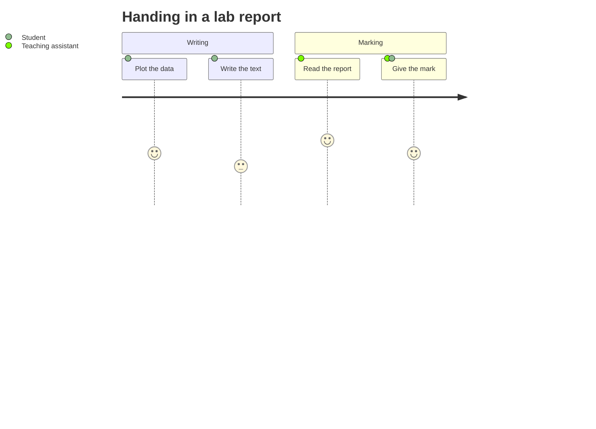

# Plans and maps

## Gantt chart

```mermaid
gantt
    title The lab project
    dateFormat YYYY-MM-DD
    section Preparation
        Read the sheet      :done, a1, 2026-11-02, 2d
        Build the circuit   :active, a2, after a1, 3d
    section Measurements
        Measure rise times  :a3, after a2, 2d
        Write the report    :crit, a4, after a3, 3d
```

## Mind map

```mermaid
mindmap
  root((Signals))
    Sampling
      Nyquist
      Aliasing
    Quantization
      Bits
      Noise
    Filters
```

## Timeline

```mermaid
timeline
    title The semester
    September : Sampling : Quantization
    October : The z-transform : Filters
    November : Lab project
    December : Exams
```

## Git graph

```mermaid
gitGraph
    commit
    branch report
    checkout report
    commit
    commit
    checkout main
    merge report
    commit
```

## User journey

```mermaid
journey
    title Handing in a lab report
    section Writing
      Plot the data: 4: Student
      Write the text: 3: Student
    section Marking
      Read the report: 5: Teaching assistant
      Give the mark: 4: Teaching assistant, Student
```
